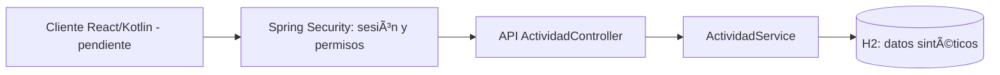
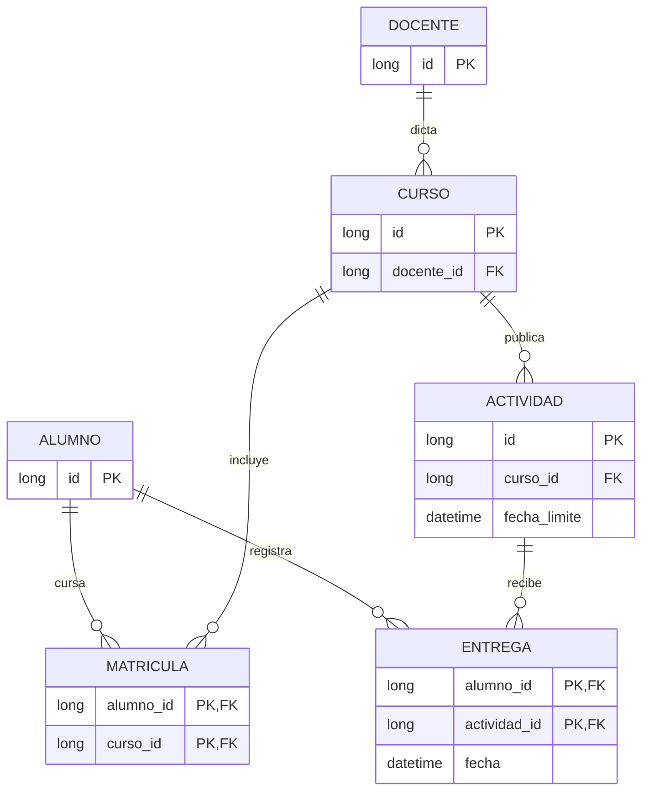

# Arquitectura del primer incremento

## Arquitectura objetivo de las bases 2026-2

La diapositiva 4 presenta: administración con React y Django; usuario con React y Kotlin y backend Spring Boot; ambos backends conectados a una BBDD compartida. Imagen original guardada en evidencia/arquitectura-base-tecsup.png y bases originales en el paquete de fuentes. Esto corrige la lectura textual anterior, que no incluía el contenido de la imagen.

```mermaid
flowchart LR
 AW[Administración: React - pendiente] --> DJ[Django - pendiente]
 UW[Usuario: React - pendiente de integrar] --> SB[Spring Boot - implementado]
 KM[Kotlin móvil - pendiente] --> SB
 DJ --> DB[(Base compartida - integración pendiente)]
 SB --> DB
```

## Componentes implementados en el incremento

## Modelo relacional implementado

Entrega permite saber si una actividad está completada para cada alumno. El listado filtra por matrícula e identidad de la sesión. Consultas parametrizadas con JdbcTemplate; no se concatena texto de búsqueda a SQL.

## Evolución pendiente
Usuarios persistidos; roles docente/apoderado/administración; aplicación móvil nativa; función de IA aprobada; servidor y BD persistente; revisión de arquitectura con los otros cursos.
